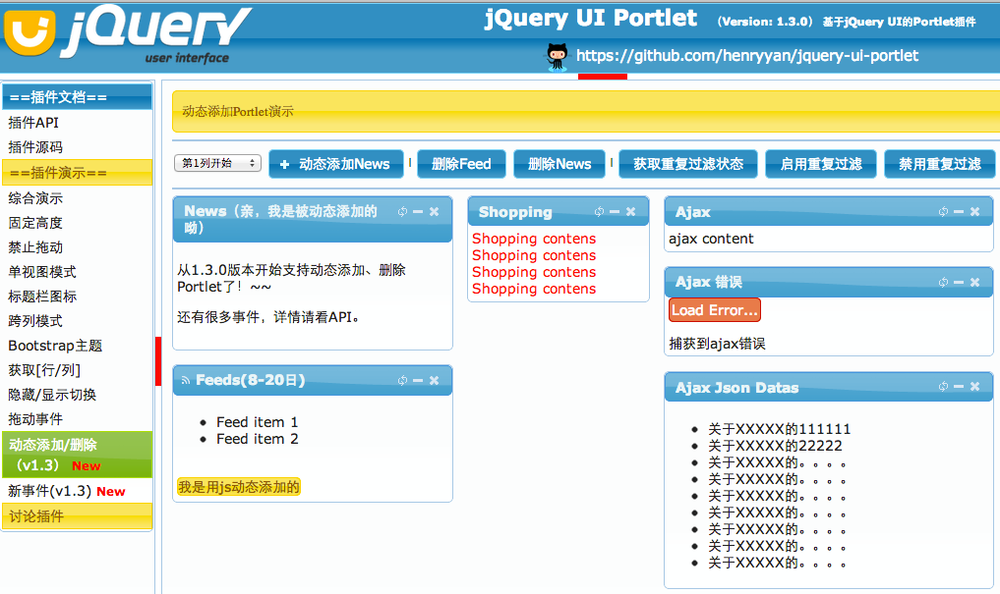

jquery-ui-portlet
=================

A portlet extend jQuery UI.

**在线Demo**：[http://www.kafeitu.me/demo/jquery-ui-portlet/index.html](http://www.kafeitu.me/demo/jquery-ui-portlet/index.html)

**浏览器支持：**Chrome、Firefox、Safari、IE6+

## Downloads

* [jquery.portlet.js(21k)](https://raw.github.com/henryyan/jquery-ui-portlet/master/script/jquery.portlet.js)
* [jquery.portlet.min.js(9.8k)](https://raw.github.com/henryyan/jquery-ui-portlet/master/script/jquery.portlet.min.js)
* [jquery.portlet.pack.js(6.2k)](https://raw.github.com/henryyan/jquery-ui-portlet/master/script/jquery.portlet.pack.js)

## Changelog

### 1.3.1（2013-09-01）

1. 修复内容区域隐藏/显示切换后图标没变动问题
2. 修复单视图模式还原后再次隐藏内容区域只隐藏了内容边框保持不变问题
3. 给DEMO页面添加了几个小图标

### 1.3.0（2013-08-18）

1. 支持动态添加Portlet元素，并且可以指定位置
2. 支持重复元素过滤功能，并且可以通过函数回调的方式决定是否允许重复元素的添加
3. 添加了针对Portlet元素的回调事件，例如：创建、删除
4. 优化了创建元素的代码（通用性）

### 1.2.0（2013-05-30）

1. 添加获取所有portlet坐标的方法（所在行、列）
2. 添加切换单个、全部portlet内容的显示或者隐藏功能（自动根据状态切换、只隐藏、只显示）
3. 添加销毁功能（destroy）
4. 添加拖动事件回调支持

### 1.1.3（2013-02-06）

1. 解决设置singleView设置为false无效问题
2. 解决双击三个按钮速度快时会启动单视图模式问题
3. 为最小化、还原功能添加动画效果

### 1.1.2（2013-01-01）

1. 修复不支持IE7问题
2. 命名空间更改：kft.portlet改为ui.portlet

### 1.1.1（2012-12-13）

1. 添加跨列模式演示
2. 添加对ajax错误的捕获和回调
3. Fixed：内容区域拖动（例如滚动条的拖动）依然可以移动单个portlet

### 1.1.0（2012-12-08）

1. 添加单视图模式
2. 单视图模式支持动画、回调
3. 添加内容高度设置
3. 添加压缩版本的js文件
5. demo页面大调整

### 1.0.1 (2012-12-01)

1.Fixed：当一列被全部拖动之后不能再拖回

### 1.0.0 （2012-11-21)

基于jquery ui的初始版本，支持多列排列，支持多种数据来源（text、ajax、json），支持各种回调。
